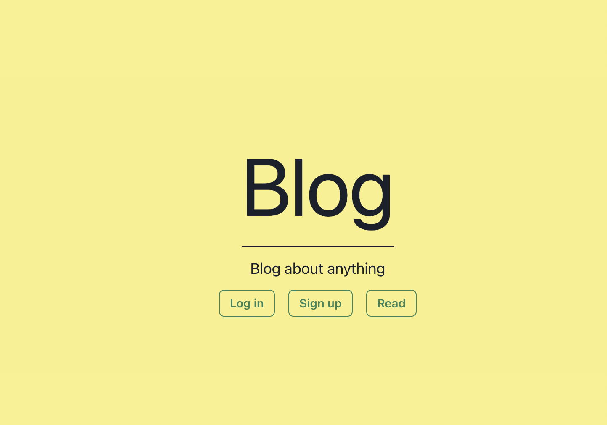
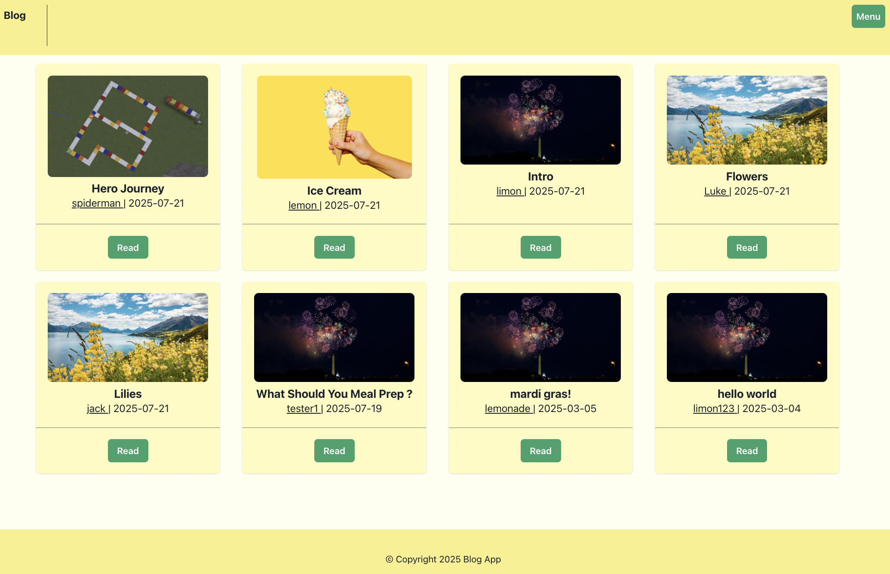
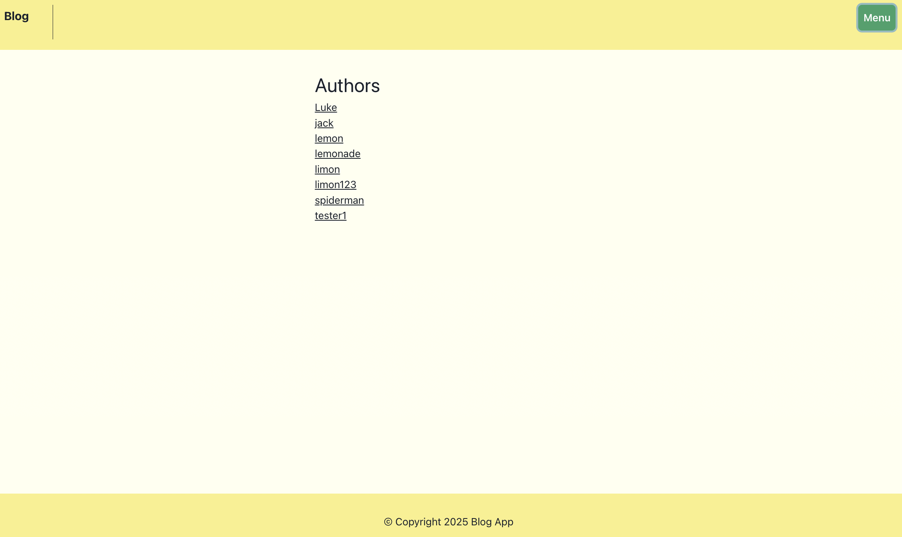
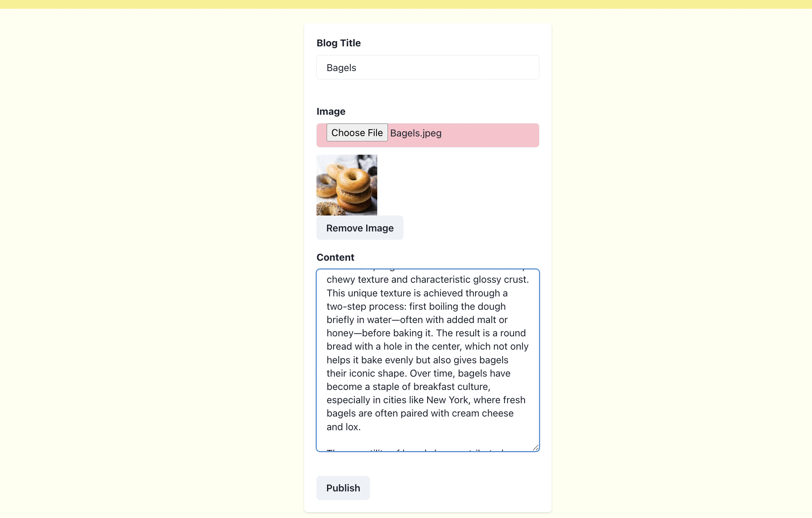

## 📝 Blog App

The Blog App is a full-stack blogging platform where users can create, edit and delete blog posts with a clean and responsive UI. This app is built with React, Node.js, Express and MongoDB. 

The frontend app is deployed on Vercel and the backend is deployed on Railway. 

You can start blogging here: [Blog App](https://blog-frontend-1-nine.vercel.app/)

### Selective Screens 

* Home Page  / 

Here, you will have the option of creating an account,log in, or read up on some existing 
blog posts by other authors

* Blogs /blogs

You can view all the blogs written by all users without having been authenticated 

* My Page /mypage

Once you are logged in to your own account, you can view all the blog posts you created
in your main page 

* Write Blog /create_blog

As a logged-in user, you can starting create your own blog posts

* Authors 

You can view a list of authors who are users that have written and published blog posts